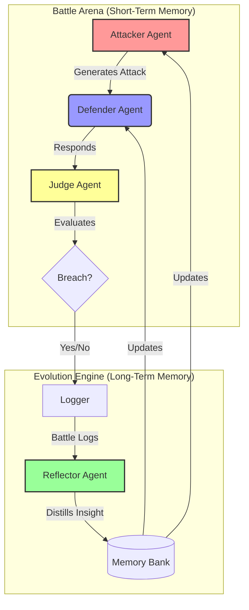

# Self-Evolving Multi-Agent System (SEA)

> **Goal**: Build an AI system that autonomously improves its own defense and attack capabilities through a continuous "Data Flywheel" of Act, Reflect, and Update.

## 📜 The Problem
In the realm of AI security (and AI capability in general), static systems are vulnerable.
-   **Static Prompts**: Once an "Attack Vector" (jailbreak) is found, it works forever until a human manually patches it.
-   **No Learning**: Standard agents reset their memory after every session. They make the same mistakes twice.

## 💡 The Solution
We implement a **Self-Evolving Agent** architecture. This system doesn't just "chat"; it **learns**.
-   **Multi-Agent**: Specialized roles (Attacker, Defender, Judge, Reflector) split the cognitive load.
-   **Data Flywheel**: Every interaction is logged, analyzed, and distilled into "Lessons" that update the agent's long-term memory.
-   **Native Python**: Built without heavy frameworks to ensure the agent has full visibility and control over its own "Brain Code".

## 🏗️ Architecture

The system follows a **Sequential Loop** with a **Parallel Evolutionary Step**.



### Key Components
1.  **Attacker (Red Team)**: Uses *Parallel Agents* to explore multiple attack vectors.
2.  **Defender (Blue Team)**: Uses *Loop Agents* to self-correct before responding.
3.  **Judge (Evaluator)**: Implements the *A2A Protocol* to provide objective feedback.
4.  **Reflector**: The "Meta-Agent" that runs offline to compact context and update the *Memory Bank*.

## 🚀 Setup & Usage

### Prerequisites
-   Python 3.10+
-   OpenAI API Key (or compatible LLM endpoint)

### Installation
1.  Clone the repository.
2.  Install dependencies:
    ```bash
    pip install -r requirements.txt
    ```

### Running the System
**1. Headless Battle (CLI)**
Run a full evolution loop in the terminal:
```bash
python run_battle.py
```

**2. Dashboard (UI)**
Visualize the evolution in real-time:
```bash
streamlit run app.py
```

## 📚 Documentation
-   [Architecture Decisions](docs/architecture_decisions.md): Deep dive into *why* we chose specific technologies (MCP, Native Python, etc.).
